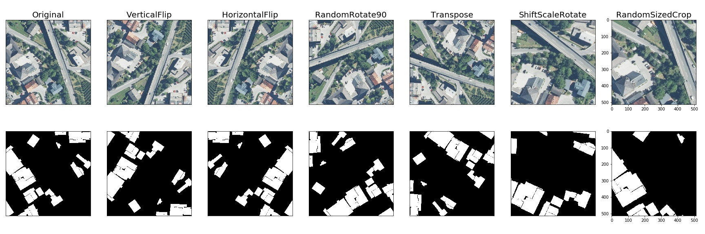
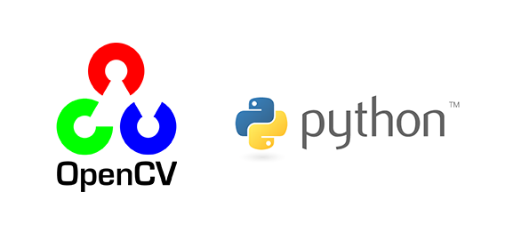
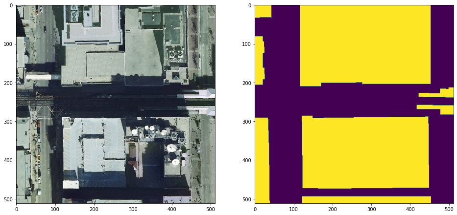
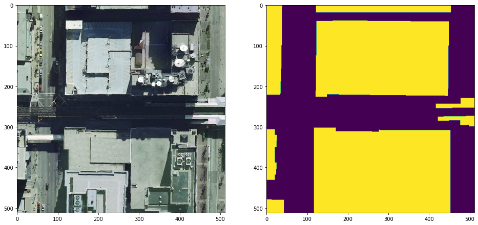
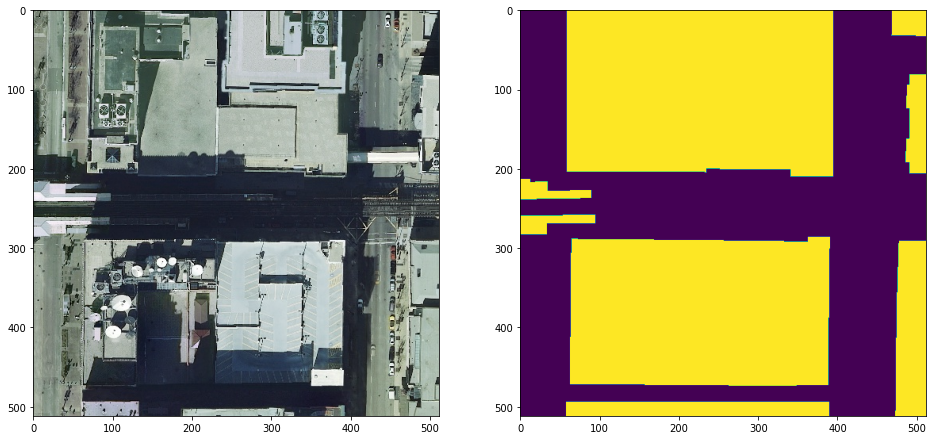
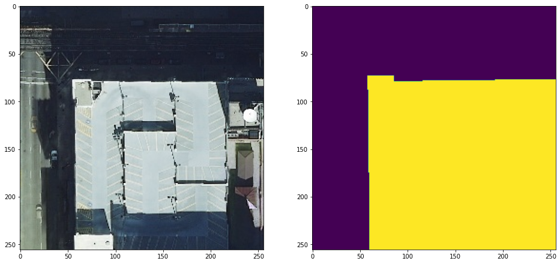

# 零基础入门语义分割-Task2 数据扩增

本章对语义分割任务中常见的数据扩增方法进行介绍，并使用OpenCV和albumentations两个库完成具体的数据扩增操作。

## 2 数据扩增方法

本章主要内容为数据扩增方法、OpenCV数据扩增、albumentations数据扩增和Pytorch读取赛题数据四个部分组成。

### 2.1 学习目标
- 理解基础的数据扩增方法
- 学习OpenCV和albumentations完成数据扩增
- Pytorch完成赛题读取

### 2.2 常见的数据扩增方法

数据扩增是一种有效的正则化方法，可以防止模型过拟合，在深度学习模型的训练过程中应用广泛。数据扩增的目的是增加数据集中样本的数据量，同时也可以有效增加样本的语义空间。

需注意：

1. 不同的数据，拥有不同的数据扩增方法；

2. 数据扩增方法需要考虑合理性，不要随意使用；

3. 数据扩增方法需要与具体任何相结合，同时要考虑到标签的变化；

对于图像分类，数据扩增方法可以分为两类：

1. 标签不变的数据扩增方法：数据变换之后图像类别不变；
2. 标签变化的数据扩增方法：数据变换之后图像类别变化；

而对于语义分割而言，常规的数据扩增方法都会改变图像的标签。如水平翻转、垂直翻转、旋转90%、旋转和随机裁剪，这些常见的数据扩增方法都会改变图像的标签，即会导致地标建筑物的像素发生改变。



### 2.3 OpenCV数据扩增

OpenCV是计算机视觉必备的库，可以很方便的完成数据读取、图像变化、边缘检测和模式识别等任务。为了加深各位对数据可做的影响，这里首先介绍OpenCV完成数据扩增的操作。




```
# 首先读取原始图片
img = cv2.imread(train_mask['name'].iloc[0])
mask = rle_decode(train_mask['mask'].iloc[0])

plt.figure(figsize=(16, 8))
plt.subplot(1, 2, 1)
plt.imshow(img)

plt.subplot(1, 2, 2)
plt.imshow(mask)
```



```
# 垂直翻转
plt.figure(figsize=(16, 8))
plt.subplot(1, 2, 1)
plt.imshow(cv2.flip(img, 0))

plt.subplot(1, 2, 2)
plt.imshow(cv2.flip(mask, 0))
```


```
# 水平翻转
plt.figure(figsize=(16, 8))
plt.subplot(1, 2, 1)
plt.imshow(cv2.flip(img, 0))

plt.subplot(1, 2, 2)
plt.imshow(cv2.flip(mask, 0))
```


```
# 随机裁剪
x, y = np.random.randint(0, 256), np.random.randint(0, 256)

plt.figure(figsize=(16, 8))
plt.subplot(1, 2, 1)
plt.imshow(img[x:x+256, y:y+256])

plt.subplot(1, 2, 2)
plt.imshow(mask[x:x+256, y:y+256])
```


### 2.4 albumentations数据扩增

albumentations是基于OpenCV的快速训练数据增强库，拥有非常简单且强大的可以用于多种任务（分割、检测）的接口，易于定制且添加其他框架非常方便。

albumentations也是计算机视觉数据竞赛中最常用的库：

- GitHub： [https://github.com/albumentations-team/albumentations](https://link.zhihu.com/?target=https%3A//github.com/albumentations-team/albumentations)
- 示例：[https://github.com/albumentations-team/albumentations_examples](https://link.zhihu.com/?target=https%3A//github.com/albumentations-team/albumentations_examples)

与OpenCV相比albumentations具有以下优点：

- albumentations支持的操作更多，使用更加方便；
- albumentations可以与深度学习框架（Keras或Pytorch）配合使用；
- albumentations支持各种任务（图像分流）的数据扩增操作

albumentations它可以对数据集进行逐像素的转换，如模糊、下采样、高斯造点、高斯模糊、动态模糊、RGB转换、随机雾化等；也可以进行空间转换（同时也会对目标进行转换），如裁剪、翻转、随机裁剪等。

```
import albumentations as A

# 水平翻转
augments = A.HorizontalFlip(p=1)(image=img, mask=mask)
img_aug, mask_aug = augments['image'], augments['mask']

# 随机裁剪
augments = A.RandomCrop(p=1, height=256, width=256)(image=img, mask=mask)
img_aug, mask_aug = augments['image'], augments['mask']

# 旋转
augments = A.ShiftScaleRotate(p=1)(image=img, mask=mask)
img_aug, mask_aug = augments['image'], augments['mask']
```

albumentations还可以组合多个数据扩增操作得到更加复杂的数据扩增操作：

```
trfm = A.Compose([
    A.Resize(256, 256),
    A.HorizontalFlip(p=0.5),
    A.VerticalFlip(p=0.5),
    A.RandomRotate90(),
])

augments = trfm(image=img, mask=mask)
img_aug, mask_aug = augments['image'], augments['mask']
plt.figure(figsize=(16, 8))
plt.subplot(1, 2, 1)
plt.imshow(augments['image'])

plt.subplot(1, 2, 2)
plt.imshow(augments['mask'])aug
```


### 2.5 Pytorch数据读取

由于本次赛题我们使用Pytorch框架讲解具体的解决方案，接下来将是解决赛题的第一步使用Pytorch读取赛题数据。在Pytorch中数据是通过Dataset进行封装，并通过DataLoder进行并行读取。所以我们只需要重载一下数据读取的逻辑就可以完成数据的读取。

- Dataset：数据集，对数据进行读取并进行数据扩增；
- DataLoder：数据读取器，对Dataset进行封装并进行批量读取；

定义Dataset：

```
import torch.utils.data as D
class TianChiDataset(D.Dataset):
    def __init__(self, paths, rles, transform):
        self.paths = paths
        self.rles = rles
        self.transform = transform
        self.len = len(paths)

    def __getitem__(self, index):
        img = cv2.imread(self.paths[index])
        mask = rle_decode(self.rles[index])
        augments = self.transform(image=img, mask=mask)
        return self.as_tensor(augments['image']), augments['mask'][None]
   
    def __len__(self):
        return self.len
```

实例化Dataset：

```
trfm = A.Compose([
    A.Resize(IMAGE_SIZE, IMAGE_SIZE),
    A.HorizontalFlip(p=0.5),
    A.VerticalFlip(p=0.5),
    A.RandomRotate90(),
])

dataset = TianChiDataset(
    train_mask['name'].values,
    train_mask['mask'].fillna('').values,
    trfm
)
```

实例化DataLoder，批大小为10：

```
loader = D.DataLoader(
    dataset, batch_size=10, shuffle=True, num_workers=0)
```

### 2.6 本章小结

本章对数据扩增方法进行简单介绍，并介绍并完成OpenCV数据扩增、albumentations数据扩增和Pytorch读取赛题数据的具体操作。

### 2.7 课后作业

1. 使用OpenCV完成图像加噪数据扩增；
2. 使用OpenCV完成图像旋转数据扩增；
3. 使用albumentations其他的的操作完成扩增操作；
4. 使用Pytorch完成赛题数据读取；