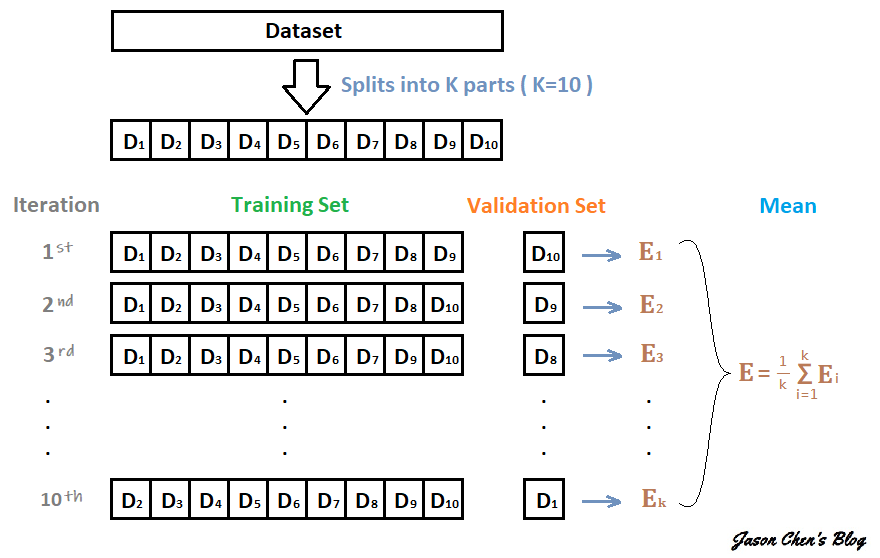
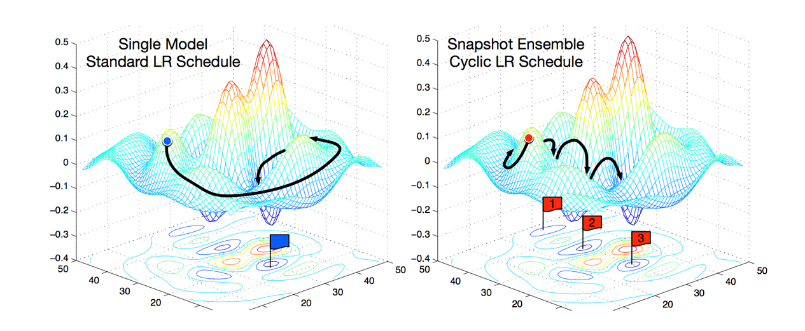
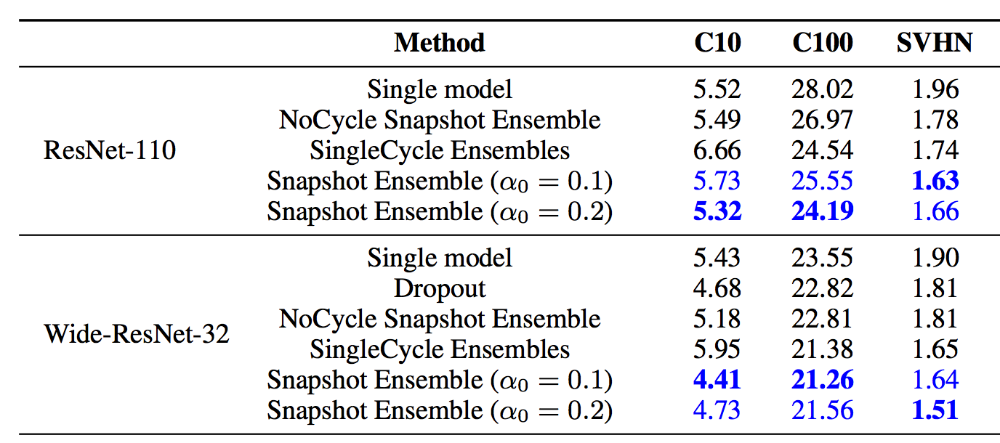

# 零基础入门语义分割-Task6 模型集成

在上一章我们学习了如何构建验证集，如何训练和验证。本章作为本次赛题学习的最后一章，将会讲解如何使用集成学习提高预测精度。

## 6 模型集成

本章讲解的知识点包括：集成学习方法、深度学习中的集成学习和结果后处理思路。

### 6.1 学习目标

- 学习集成学习方法以及交叉验证情况下的模型集成
- 学会使用深度学习模型的集成学习

### 6.2 集成学习方法

在机器学习中的集成学习可以在一定程度上提高预测精度，常见的集成学习方法有Stacking、Bagging和Boosting，同时这些集成学习方法与具体验证集划分联系紧密。

由于深度学习模型一般需要较长的训练周期，如果硬件设备不允许建议选取留出法，如果需要追求精度可以使用交叉验证的方法。

下面假设构建了10折交叉验证，训练得到10个语义分割模型。


那么在10个CNN模型可以使用如下方式进行集成：

- 对预测的结果的概率值进行平均，然后解码为具体字符；
- 对预测的字符进行投票，得到最终字符；

### 6.3 深度学习中的集成学习

此外在深度学习中本身还有一些集成学习思路的做法，值得借鉴学习：          

#### 6.3.1 Dropout

Dropout可以作为训练深度神经网络的一种技巧。在每个训练批次中，通过随机让一部分的节点停止工作。同时在预测的过程中让所有的节点都其作用。


Dropout经常出现在在先有的CNN网络中，可以有效的缓解模型过拟合的情况，也可以在预测时增加模型的精度。

#### 6.3.2 TTA
测试集数据扩增（Test Time Augmentation，简称TTA）也是常用的集成学习技巧，数据扩增不仅可以在训练时候用，而且可以同样在预测时候进行数据扩增，对同一个样本预测三次，然后对三次结果进行平均。


```python
for idx, name in enumerate(tqdm_notebook(glob.glob('./test_mask/*.png')[:])):
    image = cv2.imread(name)
    image = trfm(image)
    with torch.no_grad():
        image = image.to(DEVICE)[None]
        score1 = model(image).cpu().numpy()
        
        score2 = model(torch.flip(image, [0, 3]))
        score2 = torch.flip(score2, [3, 0]).cpu().numpy()

        score3 = model(torch.flip(image, [0, 2]))
        score3 = torch.flip(score3, [2, 0]).cpu().numpy()
        
        score = (score1 + score2 + score3) / 3.0
        score_sigmoid = score[0].argmax(0) + 1
```

#### 6.3.3 Snapshot

本章的开头已经提到，假设我们训练了10个CNN则可以将多个模型的预测结果进行平均。但是加入只训练了一个CNN模型，如何做模型集成呢?

在论文Snapshot Ensembles中，作者提出使用cyclical learning rate进行训练模型，并保存精度比较好的一些checkopint，最后将多个checkpoint进行模型集成。

          
由于在cyclical learning rate中学习率的变化有周期性变大和减少的行为，因此CNN模型很有可能在跳出局部最优进入另一个局部最优。在Snapshot论文中作者通过使用表明，此种方法可以在一定程度上提高模型精度，但需要更长的训练时间。
     

## 5.4 本章小节

在本章中我们讲解了深度学习模型做集成学习的各种方法，并以此次赛题为例讲解了部分代码。以下几点需要同学们注意

- 集成学习只能在一定程度上提高精度，并需要耗费较大的训练时间，因此建议先使用提高单个模型的精度，再考虑集成学习过程；
- 具体的集成学习方法需要与验证集划分方法结合，Dropout和TTA在所有场景有可以起作用。

 

 
